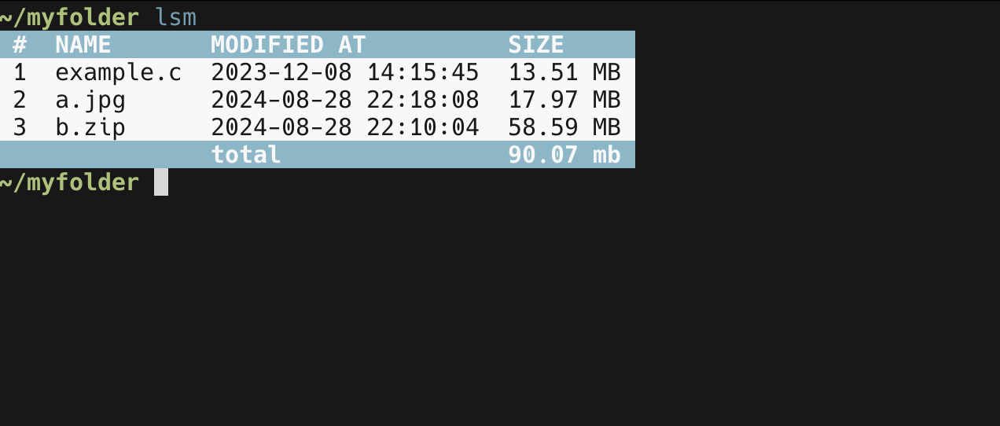
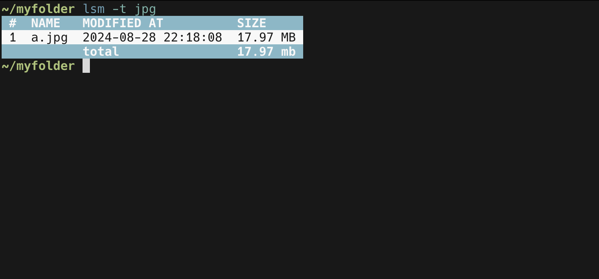

[](https://goreportcard.com/report/github.com/semihtok/lsm)
[](https://godoc.org/github.com/semihtok/lsm)
[](https://raw.githubusercontent.com/semihtok/lsm/master/LICENSE)

# lsm (α)
lsm (ls modern) is a high-performance, concurrent file system analysis tool that efficiently calculates and displays detailed directory and file sizes, optimized for handling large directories and complex file structures.

## Features

#### Listing directory with a simple command :


#### Listing directory with a specific file type:


#### Listing directory with a specific size limit:


## Usage

| Commands             | Descriptions                                               |
|----------------------|------------------------------------------------------------|
| lsm                  | list of files in current directory                         |     
| lsm -t               | list of files with specific extension in current directory |
| lsm -gt {size in MB} | list of files greater than size in current directory       |
| lsm -lt {size in MB} | list of files lower than size in current directory         |                                                            |


## Installation

### Homebrew (macOS and Linux)

```bash
 brew install semihtok/homebrew-lsm/lsm
```

### Manual Installation

```bash
git clone
cd lsm
go build -o lsm
mv lsm /usr/local/bin
```


## License
Apache License 2.0, see [LICENSE](LICENSE).

## Contributing
Contributions are welcome! Feel free to open an issue or submit a PR.

## Author
Semih Tok
